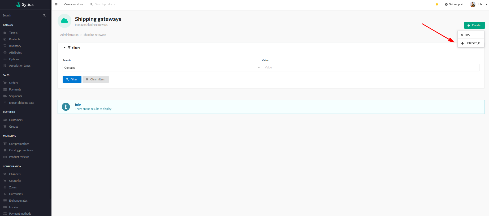
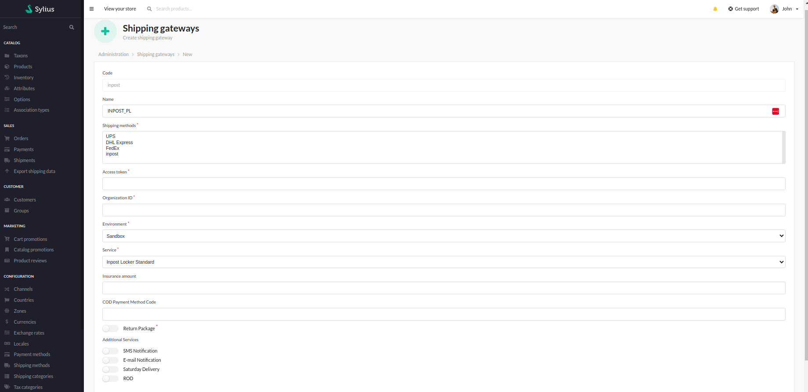
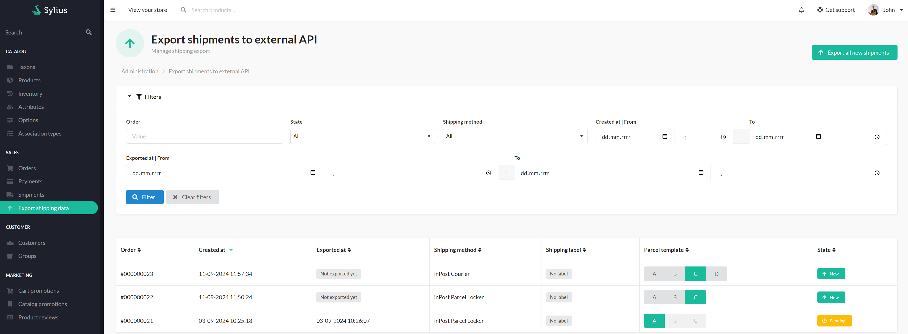

## Usage

InPost provides two main types of shipment: 
*Parcel Lockers*
and 
*Courier*.

Before creating shipping methods for InPost get familiar with their available packages sizes and services:
[Sizes and services for shipments](https://docs.inpost24.com/display/PL/%5B1.9.1%5D+Sizes+and+services+for+shipments)

### Creating shipping methods

Select 'Shipping methods' from Sylius Admin Panel and add methods for Courier and Locker (or just one of them).

**Important:**
- field 'code' for service *Parcel Lockers* must be equal to **inpost_point**
- field 'code' for service *Courier* must be equal to **inpost**

Keep in mind that:
- maximal parcel size and weight for *Parcel Locker* is: 41 x 38 x 64 cm and 25kg
- service *Parcel Locker* is available **only** for Poland
- maximal parcel size and weight for *Courier* is: 350 x 240 x 240 cm and 50kg for Poland
- maximal parcel size and weight for *Courier* is: 60 x 40 x 40 cm and 25kg for International Shipment

### Creating shipping gateways

Before creating shipping gateway for InPost you're going to need 'organization ID' and 'access token'. If you don't have it yet - please follow this instruction:
[Api configuration](https://inpost.pl/sites/default/files/pdf/instrukcja-konfiguracji-api-shipx.pdf)

Select 'Shipping gateways' from Sylius Admin Panel and add methods for Courier and Locker (or just one of them).

    

- select 'shipping method'
- enter 'Access token'
- enter 'Organization ID'
- select 'environment' (production)
- select 'InPost service' (Usually InPost Locker Standard or InPost Courier Standard)
- if you want, you can add insurance
- if you have 'cash on delivery' method in you shop - please add it's code
- if you want select additional services

    

### Exporting shipping data

Select 'Export shipping data' from Sylius Admin Panel

Now you can export each shipment or all at once

    

### Printing label

Once your order got exported you can download shipping label
